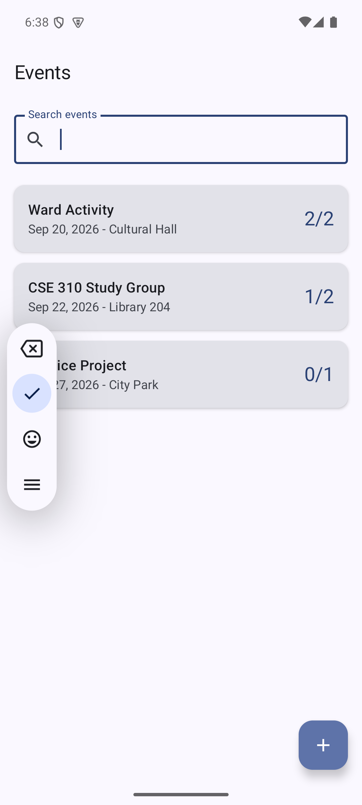
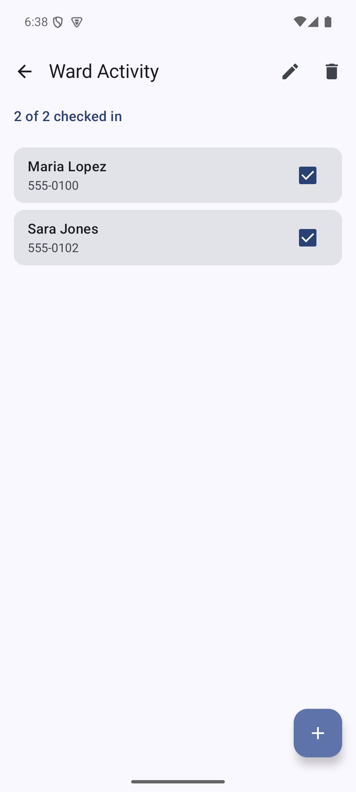
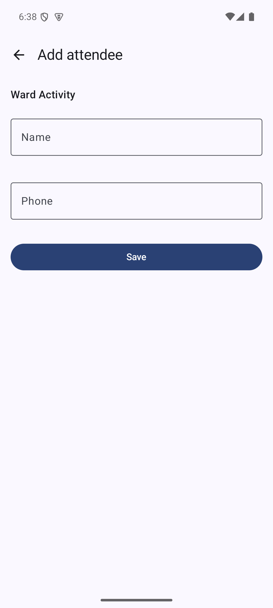

# Overview

Event Check-In is a native Android app for running the door at an event. An
organizer creates an event, registers the people who are coming, marks them as
checked in with one tap, and sees a live count for every event. Everything is
stored on the device, so the list is still there the next morning.

I wrote this software to learn Kotlin and the Android SDK. My mobile experience
until now has been in React Native, so I wanted to build a real Android app the
native way: Kotlin only, no JavaScript bridge, declarative UI with Jetpack
Compose, state in a ViewModel, and a local database with Room. Building a
check-in tracker gave me a reason to use every one of those pieces instead of
reading about them.

The app has three kinds of screens. The event list shows every event with its
check-in count and a search box. The event detail screen lists the attendees of
one event with a checkbox for each person and a running count at the top. Two
forms create and edit events and attendees, with validation messages under the
fields that are wrong.

[Software Demo Video](http://youtube.link.goes.here)

# Development Environment

- Android Studio with the Android SDK, compile and target SDK 35, minimum SDK 26
- Gradle 8.14.3, Android Gradle Plugin 8.11.0, JDK 21
- Tested on a Pixel 8 emulator running API 35

The program is written in **Kotlin 2.1.20**. The libraries it uses are Jetpack
Compose (Compose BOM 2025.05.01) with Material 3 for the interface, Navigation
Compose for moving between screens, Lifecycle ViewModel with Kotlin coroutines
and Flow for state, Room 2.7.1 with KSP for the SQLite database, and JUnit 4 for
the unit tests.

# Useful Websites

- [Kotlin documentation](https://kotlinlang.org/docs/home.html)
- [Android Basics with Compose](https://developer.android.com/courses/android-basics-compose/course)
- [Jetpack Compose state documentation](https://developer.android.com/develop/ui/compose/state)
- [Navigation Compose guide](https://developer.android.com/develop/ui/compose/navigation)
- [Room persistence library](https://developer.android.com/training/data-storage/room)
- [Kotlin flows in Android](https://developer.android.com/kotlin/flow)
- [Material 3 components for Compose](https://developer.android.com/develop/ui/compose/designsystems/material3)

# Future Work

- Add QR code scanning so a person can be checked in without looking them up.
- Add sign in and cloud sync so two people can staff the same door at once.
- Export an attendee list to CSV after the event.
- Replace the free text date field with a real date picker.
- Add instrumented Compose UI tests on top of the current unit tests.

---

# Screenshots

| Event list | Event detail | Attendee form |
| --- | --- | --- |
|  |  |  |

# What the app does

- Create, edit and delete events (name, location, date). Deleting an event asks
  for confirmation and removes its attendees with it.
- Register attendees for an event, edit them, and delete them.
- Tap the checkbox to check a person in. Every count updates itself right away.
- Search the event list by name, location or date.
- Everything is saved in a local SQLite database through Room and survives
  closing the app.

# How to run it

```bash
git clone https://github.com/franciscorodriguezsv24/cse-310-module-1.git
cd cse-310-module-1
./gradlew assembleDebug                 # build the debug APK
./gradlew installDebug                  # install it on a running emulator or device
./gradlew testDebugUnitTest             # run the unit tests
```

Opening the folder in Android Studio and pressing Run works too. Android Studio
writes `local.properties` with the path to your SDK the first time it syncs; that
file is not in the repository because it is specific to each machine.

# How the code is organized

```
app/src/main/java/com/alejandro/eventcheckin/
├── EventCheckInApplication.kt      owns the database and the repository
├── MainActivity.kt                 hosts the Compose UI
├── data/
│   ├── Event.kt, Attendee.kt       Room entities
│   ├── EventDao.kt, AttendeeDao.kt queries returning Flow
│   ├── AppDatabase.kt              the database, seeded on first run
│   ├── EventRepository.kt          the only thing the ViewModel talks to
│   └── SampleData.kt               seed rows and preview data
└── ui/
    ├── EventCheckInApp.kt          the navigation graph
    ├── events/
    │   ├── EventViewModel.kt       StateFlow state and every write
    │   ├── EventListScreen.kt      list, search, empty states
    │   ├── EventDetailScreen.kt    attendees, check-in, delete dialog
    │   ├── EventFormScreen.kt      create and edit an event
    │   ├── AttendeeFormScreen.kt   create and edit an attendee
    │   └── Validation.kt           the input rules
    └── theme/                      Material 3 colors and typography

app/src/test/java/...               unit tests for the validation rules
kotlin-basics/KotlinBasics.kt       the language exercises from the first week
```

The data flows one way: Room returns a `Flow`, the ViewModel turns it into a
`StateFlow` with `stateIn`, the composables collect it with
`collectAsStateWithLifecycle`, and every write goes back through the repository.
No composable touches a DAO.

# Module requirements

| Requirement | Where it is met |
| --- | --- |
| Written in a language that is new to me (Kotlin) | the whole `app` module and `kotlin-basics/` |
| Mobile app built on the platform UI framework | Jetpack Compose with Material 3 and `@Preview` composables |
| Multiple screens with navigation | `ui/EventCheckInApp.kt`, list -> detail -> forms |
| User input with validation | `EventFormScreen`, `AttendeeFormScreen`, `Validation.kt` |
| Displays a collection of data | `LazyColumn` in `EventListScreen` and `EventDetailScreen` |
| Local data persistence | Room entities, DAOs and `AppDatabase` |
| Published to GitHub with a README | this file |

# What I learned

- Compose is closer to React than I expected. A composable is a function of its
  state, and `remember` and `rememberSaveable` map onto `useState`, except that
  `rememberSaveable` also survives the activity being recreated on rotation.
- Rotation is the part with no React Native equivalent. Anything that lives only
  in a composable is gone after a rotation unless it is saved, which is why the
  lists live in the ViewModel and the form fields use `rememberSaveable`.
- `Flow` plus `stateIn` means the UI never asks the database for anything. Room
  emits a new list after every write and the counts update by themselves.
- Kotlin's null safety changes how the code reads. `?.`, `?:` and smart casts
  replace the defensive checks I write in JavaScript, and the compiler catches
  the cases I would have missed.
- `data class` with `copy` makes immutable updates natural, so the ViewModel
  never mutates a row in place.
- KSP generates the Room code at build time, so a bad SQL string in a `@Query`
  fails the build instead of crashing at runtime.
